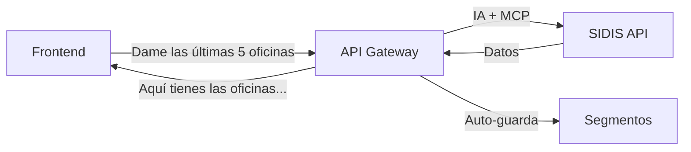

# SIDIS MCP API Gateway - Documentación para Frontend

**Versión:** 2.0.0  
**Fecha:** Octubre 2025  
**Audiencia:** Desarrolladores Frontend

## 📖 Índice

1. [Resumen Ejecutivo](#resumen-ejecutivo)
2. [Configuración Inicial](#configuración-inicial)
3. [Endpoints Disponibles](#endpoints-disponibles)
4. [Ejemplos de Implementación](#ejemplos-de-implementación)
5. [Manejo de Errores](#manejo-de-errores)
6. [Tipos TypeScript](#tipos-typescript)
7. [SDK JavaScript](#sdk-javascript)
8. [Casos de Uso Comunes](#casos-de-uso-comunes)
9. [Best Practices](#best-practices)

---

## 🎯 Resumen Ejecutivo

### ¿Qué es el SIDIS MCP API Gateway?

Una API REST inteligente que te permite hacer consultas en **lenguaje natural** a la base de datos de SIDIS y obtener respuestas estructuradas. La IA entiende tu consulta, ejecuta las operaciones necesarias y te devuelve los datos formateados.

### 🚀 Características Principales

- **✨ Consultas en Lenguaje Natural:** "Dame las últimas 5 personas creadas"
- **🤖 IA Conversacional:** Mantiene contexto entre mensajes
- **📊 Datos Reales:** Conecta directamente con SIDIS API
- **💾 Segmentos Automáticos:** Guarda consultas para reutilización
- **🔄 Multi-iteración:** La IA puede hacer múltiples operaciones en una consulta

### 🎨 Flujo Típico



---

## ⚙️ Configuración Inicial

### Base URL

```javascript
const API_BASE = "https://your-gateway.com/api"
// Para desarrollo local:
const API_BASE = "http://localhost:3000/api"
```

### Headers Requeridos

```javascript
const headers = {
  'Content-Type': 'application/json',
  // Opcional: Si implementas autenticación
  'Authorization': 'Bearer YOUR_JWT_TOKEN'
}
```

### Variables de Entorno Recomendadas

```javascript
// .env
REACT_APP_API_BASE=http://localhost:3000/api
REACT_APP_API_TIMEOUT=30000
REACT_APP_MAX_RETRIES=3
```

---

## 🔌 Endpoints Disponibles

### 1. **POST /api/chat** - Consulta Conversacional

**Descripción:** Endpoint principal para hacer consultas en lenguaje natural.

#### Request

```http
POST /api/chat
Content-Type: application/json

{
  "message": "Dame las últimas 5 oficinas creadas",
  "conversationId": "user-123",
  "model": "gpt-4o-mini",
  "systemPrompt": "Eres un asistente experto en SIDIS"
}
```

#### Parámetros

| Parámetro | Tipo | Requerido | Descripción |
|-----------|------|-----------|-------------|
| `message` | string | ✅ | Consulta en lenguaje natural |
| `conversationId` | string | ❌ | ID único para mantener contexto |
| `model` | string | ❌ | Modelo LLM a usar (default: gpt-4o-mini) |
| `systemPrompt` | string | ❌ | Prompt personalizado del sistema |

#### Response

```json
{
  "success": true,
  "data": {
    "message": "Aquí tienes las últimas 3 oficinas creadas:\n\n1. **Nemobile Applications Worldwide - Venezuela**...",
    "toolsUsed": 2,
    "iterations": 2,
    "model": "gpt-4o-mini",
    "conversationId": "user-123",
    "debug": {
      "conversationHistory": [...],
      "totalSteps": 6
    }
  }
}
```

#### Campos de Respuesta

| Campo | Tipo | Descripción |
|-------|------|-------------|
| `message` | string | Respuesta formateada de la IA |
| `toolsUsed` | number | Cantidad de herramientas MCP utilizadas |
| `iterations` | number | Iteraciones de IA realizadas |
| `model` | string | Modelo LLM utilizado |
| `conversationId` | string | ID de la conversación |
| `debug` | object | Información de debug (opcional) |

---

### 2. **GET /api/tools** - Herramientas Disponibles

**Descripción:** Lista todas las herramientas MCP disponibles.

#### Request

```http
GET /api/tools
```

#### Response

```json
{
  "success": true,
  "data": {
    "tools": [
      {
        "name": "models_discover",
        "title": "Models: discover",
        "description": "Discover available models from SIDIS API with their paths and schemas"
      },
      {
        "name": "sidis_query",
        "title": "SIDIS: dynamic query", 
        "description": "Query any SIDIS model dynamically and automatically save results as segments"
      }
    ],
    "count": 5
  }
}
```

---

### 3. **GET /api/health** - Estado del Sistema

**Descripción:** Verifica que todos los componentes estén funcionando.

#### Request

```http
GET /api/health
```

#### Response

```json
{
  "success": true,
  "data": {
    "service": "SIDIS API Gateway",
    "status": "ok",
    "timestamp": "2025-10-27T10:00:00.000Z",
    "mcp": {
      "connected": true
    },
    "llm": {
      "provider": "openai",
      "model": "gpt-4o-mini"
    }
  }
}
```

---

### 4. **GET /api/status** - Métricas Detalladas

**Descripción:** Información detallada del estado de todos los servicios.

#### Request

```http
GET /api/status
```

#### Response

```json
{
  "success": true,
  "data": {
    "mcp": {
      "connected": true,
      "toolsCount": 5
    },
    "llm": {
      "provider": "openai",
      "model": "gpt-4o-mini",
      "configured": true
    }
  }
}
```

---

### 5. **DELETE /api/conversations/:conversationId** - Limpiar Conversación

**Descripción:** Limpia el historial de una conversación específica.

#### Request

```http
DELETE /api/conversations/user-123
```

#### Response

```json
{
  "success": true,
  "data": {
    "message": "Conversación user-123 limpiada exitosamente"
  }
}
```

---

## 💻 Ejemplos de Implementación

### React Hook Personalizado

```javascript
import { useState, useCallback } from 'react';

const useChat = () => {
  const [loading, setLoading] = useState(false);
  const [error, setError] = useState(null);

  const sendMessage = useCallback(async (message, conversationId = null) => {
    setLoading(true);
    setError(null);

    try {
      const response = await fetch(`${process.env.REACT_APP_API_BASE}/chat`, {
        method: 'POST',
        headers: {
          'Content-Type': 'application/json',
        },
        body: JSON.stringify({
          message,
          conversationId: conversationId || `user-${Date.now()}`,
        }),
      });

      if (!response.ok) {
        throw new Error(`HTTP error! status: ${response.status}`);
      }

      const data = await response.json();
      
      if (!data.success) {
        throw new Error(data.error || 'Error desconocido');
      }

      return data.data;
    } catch (err) {
      setError(err.message);
      throw err;
    } finally {
      setLoading(false);
    }
  }, []);

  const clearConversation = useCallback(async (conversationId) => {
    try {
      const response = await fetch(`${process.env.REACT_APP_API_BASE}/conversations/${conversationId}`, {
        method: 'DELETE',
      });

      if (!response.ok) {
        throw new Error(`HTTP error! status: ${response.status}`);
      }

      return await response.json();
    } catch (err) {
      setError(err.message);
      throw err;
    }
  }, []);

  return {
    sendMessage,
    clearConversation,
    loading,
    error,
  };
};

export default useChat;
```

### Componente de Chat

```javascript
import React, { useState } from 'react';
import useChat from './hooks/useChat';

const ChatComponent = () => {
  const [message, setMessage] = useState('');
  const [conversation, setConversation] = useState([]);
  const [conversationId] = useState(`user-${Date.now()}`);
  const { sendMessage, loading, error } = useChat();

  const handleSubmit = async (e) => {
    e.preventDefault();
    if (!message.trim()) return;

    // Añadir mensaje del usuario
    const userMessage = { role: 'user', content: message, timestamp: new Date() };
    setConversation(prev => [...prev, userMessage]);

    try {
      const response = await sendMessage(message, conversationId);
      
      // Añadir respuesta de la IA
      const aiMessage = {
        role: 'assistant',
        content: response.message,
        timestamp: new Date(),
        toolsUsed: response.toolsUsed,
        iterations: response.iterations
      };
      
      setConversation(prev => [...prev, aiMessage]);
      setMessage('');
    } catch (err) {
      console.error('Error sending message:', err);
    }
  };

  return (
    <div className="chat-container">
      <div className="messages">
        {conversation.map((msg, index) => (
          <div key={index} className={`message ${msg.role}`}>
            <div className="content">{msg.content}</div>
            {msg.toolsUsed && (
              <div className="metadata">
                🛠️ {msg.toolsUsed} herramientas • 🔄 {msg.iterations} iteraciones
              </div>
            )}
            <div className="timestamp">
              {msg.timestamp.toLocaleTimeString()}
            </div>
          </div>
        ))}
      </div>

      <form onSubmit={handleSubmit} className="input-form">
        <input
          type="text"
          value={message}
          onChange={(e) => setMessage(e.target.value)}
          placeholder="Pregunta algo sobre SIDIS..."
          disabled={loading}
        />
        <button type="submit" disabled={loading || !message.trim()}>
          {loading ? 'Enviando...' : 'Enviar'}
        </button>
      </form>

      {error && (
        <div className="error">
          ❌ Error: {error}
        </div>
      )}
    </div>
  );
};

export default ChatComponent;
```

### Servicio API (TypeScript)

```typescript
interface ChatRequest {
  message: string;
  conversationId?: string;
  model?: string;
  systemPrompt?: string;
}

interface ChatResponse {
  message: string;
  toolsUsed: number;
  iterations: number;
  model: string;
  conversationId: string;
  debug?: {
    conversationHistory: any[];
    totalSteps: number;
  };
}

interface ApiResponse<T> {
  success: boolean;
  data?: T;
  error?: string;
}

class SidisApiClient {
  private baseUrl: string;
  private timeout: number;

  constructor(baseUrl: string, timeout: number = 30000) {
    this.baseUrl = baseUrl.replace(/\/$/, '');
    this.timeout = timeout;
  }

  private async request<T>(
    endpoint: string,
    options: RequestInit = {}
  ): Promise<ApiResponse<T>> {
    const controller = new AbortController();
    const timeoutId = setTimeout(() => controller.abort(), this.timeout);

    try {
      const response = await fetch(`${this.baseUrl}${endpoint}`, {
        ...options,
        signal: controller.signal,
        headers: {
          'Content-Type': 'application/json',
          ...options.headers,
        },
      });

      clearTimeout(timeoutId);

      if (!response.ok) {
        throw new Error(`HTTP error! status: ${response.status}`);
      }

      return await response.json();
    } catch (error) {
      clearTimeout(timeoutId);
      
      if (error.name === 'AbortError') {
        throw new Error('Request timeout');
      }
      
      throw error;
    }
  }

  async chat(request: ChatRequest): Promise<ChatResponse> {
    const response = await this.request<ChatResponse>('/chat', {
      method: 'POST',
      body: JSON.stringify(request),
    });

    if (!response.success || !response.data) {
      throw new Error(response.error || 'Chat request failed');
    }

    return response.data;
  }

  async getTools(): Promise<{ tools: any[]; count: number }> {
    const response = await this.request<{ tools: any[]; count: number }>('/tools');
    
    if (!response.success || !response.data) {
      throw new Error(response.error || 'Failed to get tools');
    }

    return response.data;
  }

  async getHealth(): Promise<any> {
    const response = await this.request<any>('/health');
    
    if (!response.success || !response.data) {
      throw new Error(response.error || 'Health check failed');
    }

    return response.data;
  }

  async clearConversation(conversationId: string): Promise<void> {
    const response = await this.request<any>(`/conversations/${conversationId}`, {
      method: 'DELETE',
    });

    if (!response.success) {
      throw new Error(response.error || 'Failed to clear conversation');
    }
  }
}

export default SidisApiClient;
```

---

## 🚨 Manejo de Errores

### Tipos de Errores Comunes

#### 1. **Error de Conectividad**

```json
{
  "success": false,
  "error": "MCP server not connected"
}
```

**Manejo:**
```javascript
if (error.includes('MCP server')) {
  // Mostrar mensaje de mantenimiento
  showMaintenanceMessage();
  // Reintentar después de un tiempo
  setTimeout(retry, 5000);
}
```

#### 2. **Error de LLM**

```json
{
  "success": false,
  "error": "OpenAI API error: Rate limit exceeded"
}
```

**Manejo:**
```javascript
if (error.includes('Rate limit')) {
  // Mostrar mensaje de límite alcanzado
  showRateLimitMessage();
  // Sugerir reintentar más tarde
}
```

#### 3. **Error de Validación**

```json
{
  "success": false,
  "error": "Message is required"
}
```

**Manejo:**
```javascript
if (error.includes('required')) {
  // Validar formulario
  validateForm();
  // Resaltar campos requeridos
}
```

### Estrategia de Retry

```javascript
const retryRequest = async (fn, maxRetries = 3, delay = 1000) => {
  for (let i = 0; i < maxRetries; i++) {
    try {
      return await fn();
    } catch (error) {
      if (i === maxRetries - 1) throw error;
      
      // Exponential backoff
      await new Promise(resolve => setTimeout(resolve, delay * Math.pow(2, i)));
    }
  }
};

// Uso
const response = await retryRequest(() => 
  apiClient.chat({ message: "Dame las últimas oficinas" })
);
```

---

## 📝 Tipos TypeScript

```typescript
// Request Types
interface ChatRequest {
  message: string;
  conversationId?: string;  
  model?: 'gpt-4o-mini' | 'gpt-4o' | 'gpt-3.5-turbo';
  systemPrompt?: string;
}

// Response Types
interface ChatResponse {
  message: string;
  toolsUsed: number;
  iterations: number;
  model: string;
  conversationId: string;
  debug?: DebugInfo;
}

interface DebugInfo {
  conversationHistory: ConversationStep[];
  totalSteps: number;
}

interface ConversationStep {
  step: number;
  role: 'user' | 'assistant' | 'tool';
  content: string;
  tool_calls?: ToolCall[];
  tool_call_id?: string;
}

interface ToolCall {
  function: string;
  arguments: Record<string, any>;
}

// API Response Wrapper
interface ApiResponse<T> {
  success: boolean;
  data?: T;
  error?: string;
}

// Health Check Types
interface HealthStatus {
  service: string;
  status: 'ok' | 'error';
  timestamp: string;
  mcp: {
    connected: boolean;
  };
  llm: {
    provider: string;
    model: string;
  };
}

// Tools Types
interface McpTool {
  name: string;
  title: string;
  description: string;
  inputSchema?: Record<string, any>;
}

interface ToolsResponse {
  tools: McpTool[];
  count: number;
}

// Error Types
interface ApiError extends Error {
  status?: number;
  code?: string;
}
```

---

## 📦 SDK JavaScript

### Instalación

```bash
# Si publicas el SDK como package
npm install @sidis/mcp-api-client

# O copia el código directamente
```

### Uso Básico

```javascript
import SidisApiClient from '@sidis/mcp-api-client';

// Inicializar cliente
const client = new SidisApiClient('http://localhost:3000/api');

// Usar en componente React
const MyComponent = () => {
  const handleQuery = async () => {
    try {
      const response = await client.chat({
        message: "Dame las últimas 5 personas creadas",
        conversationId: "user-123"
      });
      
      console.log(response.message);
      console.log(`Herramientas usadas: ${response.toolsUsed}`);
    } catch (error) {
      console.error('Error:', error);
    }
  };

  return (
    <button onClick={handleQuery}>
      Consultar SIDIS
    </button>
  );
};
```

### Configuración Avanzada

```javascript
const client = new SidisApiClient('http://localhost:3000/api', {
  timeout: 30000,
  retries: 3,
  retryDelay: 1000,
  onError: (error) => {
    console.error('API Error:', error);
    // Logging personalizado
  },
  onRetry: (attempt, error) => {
    console.log(`Retry attempt ${attempt}:`, error);
  }
});
```

---

## 🎯 Casos de Uso Comunes

### 1. **Dashboard de Datos**

```javascript
const Dashboard = () => {
  const [metrics, setMetrics] = useState(null);
  const { sendMessage } = useChat();

  useEffect(() => {
    const loadMetrics = async () => {
      const queries = [
        "¿Cuántas personas tenemos en total?",
        "¿Cuántas empresas se crearon este mes?", 
        "Dame el top 5 de ciudades con más oficinas"
      ];

      const results = await Promise.all(
        queries.map(query => sendMessage(query))
      );

      setMetrics(results);
    };

    loadMetrics();
  }, []);

  return (
    <div className="dashboard">
      {metrics?.map((metric, index) => (
        <div key={index} className="metric-card">
          {metric.message}
        </div>
      ))}
    </div>
  );
};
```

### 2. **Buscador Inteligente**

```javascript
const SmartSearch = () => {
  const [query, setQuery] = useState('');
  const [results, setResults] = useState(null);
  const { sendMessage, loading } = useChat();

  const handleSearch = async (e) => {
    e.preventDefault();
    if (!query.trim()) return;

    try {
      const response = await sendMessage(query);
      setResults(response);
    } catch (error) {
      console.error('Search error:', error);
    }
  };

  return (
    <div className="smart-search">
      <form onSubmit={handleSearch}>
        <input
          type="text"
          value={query}
          onChange={(e) => setQuery(e.target.value)}
          placeholder="Busca personas, empresas, oficinas..."
        />
        <button type="submit" disabled={loading}>
          {loading ? 'Buscando...' : 'Buscar'}
        </button>
      </form>

      {results && (
        <div className="search-results">
          <div dangerouslySetInnerHTML={{ __html: results.message }} />
          <div className="metadata">
            🛠️ {results.toolsUsed} herramientas utilizadas
          </div>
        </div>
      )}
    </div>
  );
};
```

### 3. **Generador de Reportes**

```javascript
const ReportGenerator = () => {
  const [reportType, setReportType] = useState('');
  const [dateRange, setDateRange] = useState({ start: '', end: '' });
  const [report, setReport] = useState(null);
  const { sendMessage, loading } = useChat();

  const generateReport = async () => {
    const query = `Genera un reporte de ${reportType} desde ${dateRange.start} hasta ${dateRange.end}`;
    
    try {
      const response = await sendMessage(query);
      setReport(response);
    } catch (error) {
      console.error('Report generation error:', error);
    }
  };

  return (
    <div className="report-generator">
      <div className="controls">
        <select value={reportType} onChange={(e) => setReportType(e.target.value)}>
          <option value="">Selecciona tipo de reporte</option>
          <option value="ventas">Ventas</option>
          <option value="clientes">Clientes</option>
          <option value="oportunidades">Oportunidades</option>
        </select>
        
        <input
          type="date"
          value={dateRange.start}
          onChange={(e) => setDateRange(prev => ({ ...prev, start: e.target.value }))}
        />
        
        <input
          type="date"
          value={dateRange.end}
          onChange={(e) => setDateRange(prev => ({ ...prev, end: e.target.value }))}
        />
        
        <button onClick={generateReport} disabled={loading || !reportType}>
          {loading ? 'Generando...' : 'Generar Reporte'}
        </button>
      </div>

      {report && (
        <div className="report-output">
          <pre>{report.message}</pre>
        </div>
      )}
    </div>
  );
};
```

### 4. **Chat Conversacional Avanzado**

```javascript
const AdvancedChat = () => {
  const [messages, setMessages] = useState([]);
  const [input, setInput] = useState('');
  const [conversationId] = useState(`conv-${Date.now()}`);
  const { sendMessage, clearConversation, loading } = useChat();

  const handleSend = async () => {
    if (!input.trim()) return;

    // Añadir mensaje del usuario
    const userMessage = {
      id: Date.now(),
      role: 'user',
      content: input,
      timestamp: new Date()
    };
    
    setMessages(prev => [...prev, userMessage]);
    const currentInput = input;
    setInput('');

    try {
      const response = await sendMessage(currentInput, conversationId);
      
      // Añadir respuesta de la IA
      const aiMessage = {
        id: Date.now() + 1,
        role: 'assistant',
        content: response.message,
        timestamp: new Date(),
        metadata: {
          toolsUsed: response.toolsUsed,
          iterations: response.iterations,
          model: response.model
        }
      };
      
      setMessages(prev => [...prev, aiMessage]);
    } catch (error) {
      // Añadir mensaje de error
      const errorMessage = {
        id: Date.now() + 1,
        role: 'error',
        content: `Error: ${error.message}`,
        timestamp: new Date()
      };
      
      setMessages(prev => [...prev, errorMessage]);
    }
  };

  const handleClear = async () => {
    try {
      await clearConversation(conversationId);
      setMessages([]);
    } catch (error) {
      console.error('Error clearing conversation:', error);
    }
  };

  const suggestedQueries = [
    "Dame las últimas 5 personas creadas",
    "¿Cuántas empresas tenemos en total?",
    "Muéstrame las oficinas de tecnología",
    "¿Qué oportunidades están abiertas?"
  ];

  return (
    <div className="advanced-chat">
      <div className="chat-header">
        <h3>SIDIS Assistant</h3>
        <button onClick={handleClear} disabled={loading}>
          Limpiar Chat
        </button>
      </div>

      <div className="messages-container">
        {messages.length === 0 && (
          <div className="welcome-message">
            <h4>¡Hola! ¿En qué puedo ayudarte con SIDIS?</h4>
            <div className="suggestions">
              {suggestedQueries.map((query, index) => (
                <button
                  key={index}
                  className="suggestion-button"
                  onClick={() => setInput(query)}
                >
                  {query}
                </button>
              ))}
            </div>
          </div>
        )}

        {messages.map((message) => (
          <div key={message.id} className={`message ${message.role}`}>
            <div className="message-content">
              {message.role === 'assistant' ? (
                <div dangerouslySetInnerHTML={{ __html: message.content }} />
              ) : (
                <p>{message.content}</p>
              )}
            </div>
            
            {message.metadata && (
              <div className="message-metadata">
                🛠️ {message.metadata.toolsUsed} herramientas • 
                🔄 {message.metadata.iterations} iteraciones • 
                🤖 {message.metadata.model}
              </div>
            )}
            
            <div className="message-timestamp">
              {message.timestamp.toLocaleTimeString()}
            </div>
          </div>
        ))}

        {loading && (
          <div className="message assistant loading">
            <div className="typing-indicator">
              <span></span><span></span><span></span>
            </div>
          </div>
        )}
      </div>

      <div className="chat-input">
        <input
          type="text"
          value={input}
          onChange={(e) => setInput(e.target.value)}
          onKeyPress={(e) => e.key === 'Enter' && handleSend()}
          placeholder="Pregunta algo sobre SIDIS..."
          disabled={loading}
        />
        <button onClick={handleSend} disabled={loading || !input.trim()}>
          Enviar
        </button>
      </div>
    </div>
  );
};
```

---

## ✅ Best Practices

### 1. **Gestión de Estado**

```javascript
// Usar Context para estado global
const ChatContext = createContext();

const ChatProvider = ({ children }) => {
  const [conversations, setConversations] = useState({});
  const [activeConversation, setActiveConversation] = useState(null);

  return (
    <ChatContext.Provider value={{
      conversations,
      activeConversation,
      setActiveConversation
    }}>
      {children}
    </ChatContext.Provider>
  );
};
```

### 2. **Optimización de Performance**

```javascript
// Usar React.memo para componentes de mensaje
const Message = React.memo(({ message }) => {
  return (
    <div className={`message ${message.role}`}>
      {message.content}
    </div>
  );
});

// Debounce para búsquedas
const useDebounce = (value, delay) => {
  const [debouncedValue, setDebouncedValue] = useState(value);

  useEffect(() => {
    const handler = setTimeout(() => {
      setDebouncedValue(value);
    }, delay);

    return () => {
      clearTimeout(handler);
    };
  }, [value, delay]);

  return debouncedValue;
};
```

### 3. **Manejo de Errores Robusto**

```javascript
// Error Boundary personalizado
class ChatErrorBoundary extends React.Component {
  constructor(props) {
    super(props);
    this.state = { hasError: false, error: null };
  }

  static getDerivedStateFromError(error) {
    return { hasError: true, error };
  }

  componentDidCatch(error, errorInfo) {
    console.error('Chat Error:', error, errorInfo);
    // Enviar a servicio de logging
  }

  render() {
    if (this.state.hasError) {
      return (
        <div className="error-fallback">
          <h3>Algo salió mal con el chat</h3>
          <button onClick={() => this.setState({ hasError: false, error: null })}>
            Intentar de nuevo
          </button>
        </div>
      );
    }

    return this.props.children;
  }
}
```

### 4. **Validación de Datos**

```javascript
// Validar respuestas de la API
const validateChatResponse = (response) => {
  if (!response || typeof response !== 'object') {
    throw new Error('Invalid response format');
  }

  if (!response.success) {
    throw new Error(response.error || 'Request failed');
  }

  if (!response.data || !response.data.message) {
    throw new Error('Invalid response data');
  }

  return true;
};
```

### 5. **Accessibility**

```javascript
// Soporte para lectores de pantalla
const AccessibleChat = () => {
  const messagesEndRef = useRef(null);

  const scrollToBottom = () => {
    messagesEndRef.current?.scrollIntoView({ behavior: 'smooth' });
  };

  useEffect(scrollToBottom, [messages]);

  return (
    <div className="chat-container" role="log" aria-live="polite">
      {messages.map((message, index) => (
        <div
          key={index}
          className={`message ${message.role}`}
          role="article"
          aria-label={`${message.role} message`}
        >
          {message.content}
        </div>
      ))}
      <div ref={messagesEndRef} />
    </div>
  );
};
```

---

## 🔧 CSS Recomendado

```css
/* Chat Container */
.chat-container {
  display: flex;
  flex-direction: column;
  height: 100vh;
  max-width: 800px;
  margin: 0 auto;
  border: 1px solid #e1e5e9;
  border-radius: 8px;
  overflow: hidden;
}

/* Messages */
.messages-container {
  flex: 1;
  overflow-y: auto;
  padding: 16px;
  background: #f8f9fa;
}

.message {
  margin-bottom: 16px;
  padding: 12px 16px;
  border-radius: 8px;
  max-width: 80%;
}

.message.user {
  background: #007bff;
  color: white;
  margin-left: auto;
  text-align: right;
}

.message.assistant {
  background: white;
  border: 1px solid #e1e5e9;
  margin-right: auto;
}

.message.error {
  background: #f8d7da;
  color: #721c24;
  border: 1px solid #f5c6cb;
}

/* Message Metadata */
.message-metadata {
  font-size: 0.8em;
  color: #6c757d;
  margin-top: 8px;
  font-style: italic;
}

.message-timestamp {
  font-size: 0.7em;
  color: #adb5bd;
  margin-top: 4px;
}

/* Input */
.chat-input {
  display: flex;
  padding: 16px;
  background: white;
  border-top: 1px solid #e1e5e9;
}

.chat-input input {
  flex: 1;
  padding: 12px;
  border: 1px solid #e1e5e9;
  border-radius: 6px;
  margin-right: 8px;
  font-size: 14px;
}

.chat-input button {
  padding: 12px 24px;
  background: #007bff;
  color: white;
  border: none;
  border-radius: 6px;
  cursor: pointer;
  font-size: 14px;
}

.chat-input button:disabled {
  background: #6c757d;
  cursor: not-allowed;
}

/* Loading Indicator */
.typing-indicator {
  display: flex;
  align-items: center;
  gap: 4px;
}

.typing-indicator span {
  width: 8px;
  height: 8px;
  border-radius: 50%;
  background: #6c757d;
  animation: typing 1.4s infinite ease-in-out;
}

.typing-indicator span:nth-child(2) {
  animation-delay: 0.2s;
}

.typing-indicator span:nth-child(3) {
  animation-delay: 0.4s;
}

@keyframes typing {
  0%, 80%, 100% {
    transform: scale(0.8);
    opacity: 0.5;
  }
  40% {
    transform: scale(1);
    opacity: 1;
  }
}

/* Suggestions */
.suggestions {
  display: flex;
  flex-wrap: wrap;
  gap: 8px;
  margin-top: 16px;
}

.suggestion-button {
  padding: 8px 16px;
  background: #f8f9fa;
  border: 1px solid #e1e5e9;
  border-radius: 20px;
  cursor: pointer;
  font-size: 14px;
  transition: all 0.2s;
}

.suggestion-button:hover {
  background: #e9ecef;
  border-color: #adb5bd;
}

/* Responsive */
@media (max-width: 768px) {
  .chat-container {
    height: 100vh;
    border-radius: 0;
    border: none;
  }
  
  .message {
    max-width: 90%;
  }
  
  .suggestions {
    flex-direction: column;
  }
  
  .suggestion-button {
    text-align: left;
  }
}
```

---

## 🎯 Resumen para Implementación

### ✅ **Checklist de Implementación**

1. **Setup Inicial**
   - [ ] Configurar variables de entorno
   - [ ] Instalar dependencias
   - [ ] Configurar cliente API

2. **Componentes Core**
   - [ ] Hook useChat
   - [ ] Componente de Chat básico
   - [ ] Manejo de errores
   - [ ] Loading states

3. **Características Avanzadas**
   - [ ] Historial de conversaciones
   - [ ] Sugerencias de consultas
   - [ ] Exportación de resultados
   - [ ] Modo offline

4. **UX/UI**
   - [ ] Diseño responsive
   - [ ] Accessibility
   - [ ] Animaciones de carga
   - [ ] Estados de error amigables

5. **Testing**
   - [ ] Tests unitarios de hooks
   - [ ] Tests de integración de API
   - [ ] Tests de componentes
   - [ ] Tests de manejo de errores

### 🚀 **Próximos Pasos**

1. **Implementar chat básico** con el hook proporcionado
2. **Añadir casos de uso específicos** de tu aplicación
3. **Personalizar UI/UX** según tu design system
4. **Integrar con tu sistema de autenticación** existente
5. **Añadir analytics** para trackear uso

---

**¿Necesitas ayuda con alguna implementación específica?** ¡Estamos aquí para ayudarte! 🚀

---

**Última actualización:** Octubre 27, 2025