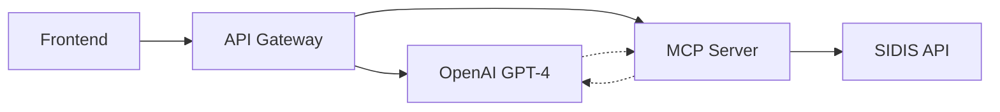
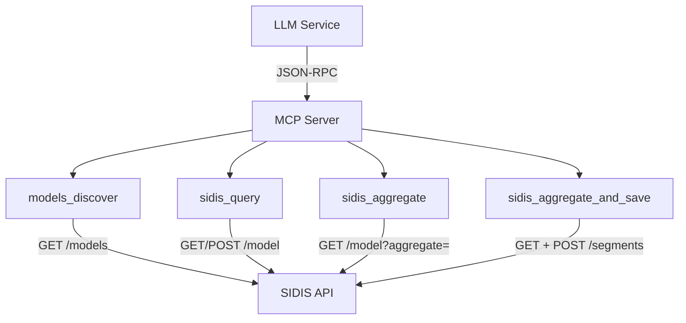

# SIDIS MCP API Gateway - Documentación Técnica

**Versión:** 2.0.0  
**Fecha:** Octubre 2025  
**Autor:** Tyson Cardelli

## 📖 Índice

1. [Resumen Ejecutivo](#resumen-ejecutivo)
2. [Arquitectura del Sistema](#arquitectura-del-sistema)
3. [MCP Server Avanzado](#mcp-server-avanzado)
4. [Sistema de Segmentos Automáticos](#sistema-de-segmentos-automáticos)
5. [Herramientas MCP Disponibles](#herramientas-mcp-disponibles)
6. [API Reference](#api-reference)
7. [Configuración](#configuración)
8. [Despliegue](#despliegue)
9. [Ejemplos Prácticos](#ejemplos-prácticos)
10. [Resolución de Problemas](#resolución-de-problemas)
11. [Roadmap](#roadmap)

---

## 🎯 Resumen Ejecutivo

### ¿Qué es SIDIS MCP API Gateway?

SIDIS MCP API Gateway es una **solución comercial completa** que transforma cualquier servidor MCP de SIDIS en un API Gateway inteligente con **descubrimiento dinámico de modelos**, **IA conversacional avanzada** y **sistema de segmentos automáticos**.

### 🚀 Logros Implementados (v2.0)

- ✅ **Sistema Dinámico Universal:** Se adapta automáticamente a cualquier esquema SIDIS
- ✅ **IA Multi-Iteración:** OpenAI GPT-4o con function calling y hasta 3 iteraciones
- ✅ **Segmentos Automáticos:** Guarda automáticamente consultas como segmentos reutilizables
- ✅ **Agregaciones MongoDB:** Soporte completo para pipelines de agregación avanzados
- ✅ **Arquitectura Comercial:** Lista para producción con logging, rate limiting y JWT
- ✅ **Zero Configuration:** Descubre modelos automáticamente vía `/models` endpoint

### Valor de Negocio

- **Para Desarrolladores:** Una sola API para todos los modelos SIDIS + IA conversacional + segmentos automáticos
- **Para Clientes:** "Dime qué necesitas" → respuesta automática con datos reales + guardado automático para reutilización
- **Para el Negocio:** Producto escalable que funciona con cualquier configuración SIDIS + analytics automático
- **Para DevOps:** Cero mantenimiento - se adapta automáticamente a cambios de schema
- **Para Data Analysis:** Segmentos automáticos con pipelines MongoDB reutilizables

### Tecnologías Clave



---

## 🔄 Sistema Dinámico de Descubrimiento (v2.0)

### Innovación Clave: Zero-Configuration Architecture

El sistema ya no requiere configuración manual de modelos. **Se autodescubre automáticamente.**

#### Workflow Dinámico:
```bash
1. LLM recibe consulta: "Lista los últimos 5 people creados"
2. Sistema llama: models_discover() → GET /models 
3. SIDIS responde: [{"name":"People","path":"/people"}, ...]
4. Sistema usa: sidis_query("/people", "list", limit=5)
5. Resultado: Datos reales de SIDIS
```

#### Herramientas MCP Dinámicas:
- **`models_discover`**: Descubre modelos disponibles con agregación optimizada
- **`sidis_query`**: Consulta genérica para cualquier modelo (list/get/create/count)

#### Ventajas vs Sistema Estático:
- ✅ **Escalable**: Funciona con nuevos modelos sin código
- ✅ **Mantenible**: Un solo endpoint genérico vs N endpoints específicos  
- ✅ **Robusto**: Se adapta a cambios de schema automáticamente
- ✅ **Performance**: Agregación optimizada para respuestas compactas

---

## 🏗️ Arquitectura del Sistema

### Flujo de Datos Completo

1. **Cliente** envía consulta en lenguaje natural
2. **API Gateway** recibe y valida la petición
3. **LLM Service** determina qué herramientas usar
4. **MCP Service** ejecuta operaciones en SIDIS
5. **LLM Service** genera respuesta final
6. **Cliente** recibe datos estructurados

### Componentes Principales

```
┌─────────────────┐    ┌─────────────────┐    ┌─────────────────┐
│   Frontend      │    │  API Gateway    │    │   SIDIS API     │
│                 │    │                 │    │                 │
│ React/Vue/etc   │◄──►│ Express.js      │◄──►│ REST Endpoints  │
│                 │    │ + OpenAI        │    │                 │
└─────────────────┘    └─────────────────┘    └─────────────────┘
                              ▲
                              │
                    ┌─────────────────┐
                    │   MCP Server    │
                    │                 │
                    │ Tool Execution  │
                    └─────────────────┘
```

---

## 🤖 MCP Server Avanzado

### Servidor MCP SIDIS v2.0

El MCP Server (`src/mcp/sidis-mcp.ts`) es el corazón inteligente del sistema, que actúa como bridge entre la IA y la API de SIDIS.

#### Características Principales:

- **🔍 Descubrimiento Dinámico**: Auto-detecta modelos disponibles
- **📊 Agregaciones MongoDB**: Soporte completo para pipelines complejos
- **💾 Segmentos Automáticos**: Guarda consultas para reutilización
- **⚡ Optimización**: Respuestas compactas con agregación inteligente

#### Arquitectura MCP:



---

## 🎯 Sistema de Segmentos Automáticos

### ¿Qué son los Segmentos Automáticos?

Cada consulta que realices se guarda automáticamente como un **segmento reutilizable** que contiene:

- **Pipeline de Agregación**: La consulta MongoDB exacta que se ejecutó
- **Metadatos**: Modelo, descripción, fechas de creación/expiración
- **Configuración**: Filtros, límites, ordenamientos aplicados

### Flujo de Segmentos Automáticos:

```bash
1. Usuario: "Dame las últimas 5 oficinas"
2. MCP ejecuta: sidis_query("/offices", "list", limit=5)
3. Pipeline generado: [{"$sort":{"createdAt":-1}}, {"$limit":5}]
4. Automáticamente: POST /segments con el pipeline
5. Segmento creado: "Consulta Office - 2025-10-24" (expira en 72h)
```

### Estructura del Segmento:

```json
{
  "_id": "68fbc45f09e6ce7a4d4c16a7",
  "name": "Consulta Office - 2025-10-24",
  "description": "Consulta automática: 3 registros del modelo Office (límite: 5, saltar: 0)",
  "model": "Office",
  "type": "aggregate",
  "status": "active",
  "expireIn": "2025-10-27T18:24:31.149Z",
  "aggregate": [
    {"$sort": {"createdAt": -1, "_id": -1}},
    {"$limit": 5}
  ]
}
```

### Ventajas del Sistema:

- ✅ **Reutilización**: Los pipelines se pueden ejecutar nuevamente
- ✅ **Auditoría**: Historial completo de consultas realizadas
- ✅ **Performance**: Pipelines optimizados MongoDB
- ✅ **Expiración**: Limpieza automática después de 72 horas
- ✅ **Analytics**: Base de datos de patrones de consulta

---

## 🛠️ Herramientas MCP Disponibles

### 1. **models_discover**
Descubre todos los modelos disponibles en SIDIS.

```typescript
{
  title: "Models: discover",
  description: "Discover available models from SIDIS API with their paths and schemas. ALWAYS call this first before any other operation.",
  inputSchema: {}
}
```

**Uso típico:**
```bash
LLM → models_discover() → Lista de modelos con paths
```

**Respuesta:**
```json
[
  {"_id": "...", "name": "People", "path": "/people"},
  {"_id": "...", "name": "Office", "path": "/offices"},
  {"_id": "...", "name": "Company", "path": "/companies"}
]
```

### 2. **sidis_query** (⭐ Principal)
Herramienta universal para consultar cualquier modelo con **segmento automático**.

```typescript
{
  title: "SIDIS: dynamic query",
  description: "Query any SIDIS model dynamically and automatically save results as segments when applicable.",
  inputSchema: {
    modelPath: string,        // "/people", "/offices", etc.
    operation: "list|get|create|count",
    limit?: number,           // Máximo 100
    skip?: number,           // Para paginación
    match?: object,          // Filtros MongoDB
    id?: string,             // Para operación "get"
    data?: object,           // Para operación "create"
    saveAsSegment?: boolean  // default: true
  }
}
```

**Ejemplos de uso:**

```javascript
// Consulta simple
sidis_query({
  modelPath: "/people",
  operation: "list",
  limit: 5
})

// Con filtros
sidis_query({
  modelPath: "/companies", 
  operation: "list",
  match: {"industry": "technology"},
  limit: 10
})

// Crear registro
sidis_query({
  modelPath: "/people",
  operation: "create", 
  data: {"name": "Juan Pérez", "email": "juan@example.com"}
})
```

### 3. **sidis_aggregate**
Ejecuta agregaciones MongoDB avanzadas **sin guardar** como segmento.

```typescript
{
  title: "SIDIS: aggregate data",
  description: "Perform MongoDB aggregation on a SIDIS model. Use this for complex queries, grouping, calculations, etc.",
  inputSchema: {
    modelPath: string,
    pipeline: Array<object>,  // Pipeline MongoDB
    match?: object           // Filtro inicial opcional
  }
}
```

**Ejemplo:**
```javascript
sidis_aggregate({
  modelPath: "/people",
  pipeline: [
    {"$group": {"_id": "$city", "count": {"$sum": 1}}},
    {"$sort": {"count": -1}},
    {"$limit": 10}
  ]
})
```

### 4. **sidis_aggregate_and_save** (🎯 Avanzada)
Ejecuta agregación Y guarda automáticamente como segmento personalizado.

```typescript
{
  title: "SIDIS: create aggregate and save as segment", 
  description: "Perform aggregation on a SIDIS model and save the result as a segment. This combines querying with automatic segment creation.",
  inputSchema: {
    modelPath: string,
    modelName: string,        // "People", "Companies"
    segmentName?: string,     // Nombre personalizado
    segmentDescription?: string,
    pipeline: Array<object>,
    match?: object
  }
}
```

**Ejemplo:**
```javascript
sidis_aggregate_and_save({
  modelPath: "/people",
  modelName: "People",
  segmentName: "Personas de Tecnología",
  segmentDescription: "Personas que trabajan en empresas de tecnología",
  pipeline: [
    {"$lookup": {"from": "companies", "localField": "companyId", "foreignField": "_id", "as": "company"}},
    {"$match": {"company.industry": "technology"}},
    {"$project": {"name": 1, "email": 1, "company.name": 1}}
  ]
})
```

### 5. **sidis_get_model_schema**
Obtiene el esquema completo de un modelo específico.

```typescript
{
  title: "SIDIS: get model schema",
  description: "Fetch the full model definition/schema from SIDIS API for a given model path",
  inputSchema: {
    modelPath: string  // "/people", "/companies", etc.
  }
}
```

---

## 🔧 Componentes Implementados

### 1. Servicios Core

#### **McpService** (`src/services/mcp.service.ts`)
```typescript
class McpService {
    // Conexión con el servidor MCP avanzado de SIDIS
    async initialize(): Promise<void>
    async callTool(toolName: string, args: any): Promise<any>
    async getAvailableTools(): Promise<McpTool[]>
    disconnect(): void
    isReady(): boolean
}
```

**Funciones:**
- ✅ Spawn del proceso MCP server avanzado
- ✅ Comunicación JSON-RPC 2.0 con 5 herramientas
- ✅ Manejo de timeouts y errores
- ✅ Lista dinámica de herramientas con schemas
- ✅ Integración con sistema de segmentos automáticos
- ✅ Soporte para agregaciones MongoDB complejas

#### **LLMService** (`src/services/llm.service.ts`)
```typescript
class LLMService {
    // Integración con OpenAI (extensible a otros LLMs)
    async generateResponse(messages: ChatMessage[], tools?: any[]): Promise<ChatMessage>
    formatToolsForLLM(tools: any[]): any[]
}
```

**Funciones:**
- ✅ Integración OpenAI GPT-4
- ✅ Function calling automático
- ✅ Formateo de herramientas MCP para LLM
- 🔄 Preparado para Anthropic, Gemini

### 2. Controladores

#### **ChatController** (`src/controllers/chat.controller.ts`)
```typescript
class ChatController {
    async chat(req: Request, res: Response): Promise<void>
    async getTools(req: Request, res: Response): Promise<void>
    async clearConversation(req: Request, res: Response): Promise<void>
}
```

**Funciones:**
- ✅ Manejo de conversaciones multi-turn
- ✅ Ejecución automática de herramientas
- ✅ Historial de conversación
- ✅ System prompts especializados para SIDIS

### 3. Sistema de Tipos

#### **Tipos API** (`src/types/api.types.ts`)
```typescript
interface ChatRequest {
    message: string;
    model?: string;
    provider?: string;
    conversationId?: string;
    systemPrompt?: string;
}

interface ChatResponse {
    message: string;
    toolsUsed: number;
    model: string;
    conversationId: string;
}
```

#### **Tipos MCP** (`src/types/mcp.types.ts`)
```typescript
interface McpTool {
    name?: string;
    title: string;
    description: string;
    inputSchema: Record<string, any>;
}
```

### 4. Configuración y Utils

#### **CONFIG** (`src/utils/config.ts`)
```typescript
export const CONFIG = {
    PORT: number;
    SIDIS_API_BASE: string;
    SIDIS_API_KEY: string;
    LLM_PROVIDER: 'openai' | 'anthropic' | 'gemini';
    LLM_API_KEY: string;
    LLM_MODEL: string;
    // ... más configuraciones
}
```

#### **Logger** (`src/utils/logger.ts`)
```typescript
class Logger {
    static error(message: string, ...args: any[]): void
    static warn(message: string, ...args: any[]): void
    static info(message: string, ...args: any[]): void
    static debug(message: string, ...args: any[]): void
}
```

---

## � Ejemplos Prácticos del Sistema Dinámico

### Caso 1: Descubrir Modelos Disponibles
```bash
curl -X POST http://localhost:3000/api/chat \
  -H "Content-Type: application/json" \
  -d '{"message": "¿Qué modelos están disponibles?", "conversationId": "demo-1"}'
```

**Respuesta:**
```json
{
  "success": true, 
  "data": {
    "message": "Encontré 65 modelos disponibles: People, Companies, Leads, Activities, Tasks, etc. ¿Con cuál te gustaría trabajar?",
    "toolsUsed": 1
  }
}
```

### Caso 2: Consulta Compleja Multi-Iteración
```bash
curl -X POST http://localhost:3000/api/chat \
  -H "Content-Type: application/json" \
  -d '{"message": "Muéstrame los últimos 3 people creados con sus emails", "conversationId": "demo-2"}'
```

**Flujo Interno:**
1. **Iteración 1**: `models_discover()` → Encuentra modelo "People" con path "/people"
2. **Iteración 2**: `sidis_query("/people", "list", limit=3)` → Obtiene datos reales
3. **Resultado**: Datos formateados con nombres y emails

### Caso 3: Operación Create Dinámica  
```bash
curl -X POST http://localhost:3000/api/chat \
  -H "Content-Type: application/json" \
  -d '{"message": "Crea una nueva persona llamada Juan Pérez con email juan@example.com", "conversationId": "demo-3"}'
```

**El sistema:**
1. Descubre que "People" existe
2. Ejecuta `sidis_query("/people", "create", data={"name": "Juan Pérez", "email": "juan@example.com"})`
3. Confirma la creación exitosa

### Caso 4: Filtros y Búsquedas Avanzadas
```bash
# "Busca todas las companies que contengan 'Tech' en el nombre"
# El sistema automáticamente usa agregación MongoDB:
{
  "modelPath": "/companies",
  "operation": "list", 
  "match": {"name": {"$regex": "Tech", "$options": "i"}}
}
```

---

## �🔌 API Reference

### Base URL
```
http://localhost:3000/api
```

### Endpoints

#### **POST /chat**
Conversación inteligente con SIDIS

**Request:**
```json
{
    "message": "Lista los últimos 5 leads creados",
    "conversationId": "user-123",
    "model": "gpt-4o-mini"
}
```

**Response:**
```json
{
    "success": true,
    "data": {
        "message": "Aquí tienes los últimos 5 leads:\n1. Juan Pérez - Creado: 2025-10-13\n...",
        "toolsUsed": 2,
        "model": "gpt-4o-mini",
        "conversationId": "user-123"
    }
}
```

#### **GET /tools**
Lista de herramientas MCP disponibles

**Response:**
```json
{
    "success": true,
    "data": {
        "tools": [
            {
                "name": "leads_list",
                "title": "List Leads",
                "description": "Lista leads con filtros opcionales"
            }
        ],
        "count": 15
    }
}
```

#### **GET /health**
Estado del sistema

**Response:**
```json
{
    "success": true,
    "data": {
        "service": "SIDIS API Gateway",
        "status": "ok",
        "timestamp": "2025-10-13T10:00:00.000Z",
        "mcp": {
            "connected": true
        },
        "llm": {
            "provider": "openai",
            "model": "gpt-4o-mini"
        }
    }
}
```

#### **GET /status**
Métricas detalladas

**Response:**
```json
{
    "success": true,
    "data": {
        "mcp": {
            "connected": true,
            "toolsCount": 15
        },
        "llm": {
            "provider": "openai",
            "model": "gpt-4o-mini",
            "configured": true
        }
    }
}
```

---

## ⚙️ Configuración

### Variables de Entorno (`.env`)

```bash
# Servidor
PORT=3000
NODE_ENV=development

# SIDIS API
SIDIS_API_BASE=https://app4.sidis.ai/sidis/api
SIDIS_API_KEY=Bearer tu_token_real
SIDIS_MODELS_PATH=/models

# LLM
LLM_PROVIDER=openai
LLM_API_KEY=sk-tu_key_real
LLM_MODEL=gpt-4o-mini

# MCP
MCP_SERVER_PATH=../MCP/src/server.ts

# Opcional
JWT_SECRET=tu_jwt_secret
RATE_LIMIT_WINDOW_MS=900000
RATE_LIMIT_MAX_REQUESTS=100
```

### Configuración del MCP Server

El sistema espera que tu servidor MCP esté en la ruta especificada por `MCP_SERVER_PATH` y que tenga:

- Variables de entorno: `API_BASE`, `MODELS_PATH`, `BEARER_TOKEN`
- Salida esperada: `"MCP (stdio) listo"` cuando esté listo
- Protocolo: JSON-RPC 2.0 sobre stdio

---

## 🚀 Despliegue

### Desarrollo Local

```bash
# 1. Instalación
npm install
npm install -g tsx

# 2. Configuración
cp .env.example .env
# Editar .env con credenciales reales

# 3. Ejecución
npm run dev          # Con hot reload
npm run start:simple # Solo servidor básico
npm start           # Servidor completo
```

### Producción

```bash
# 1. Build
npm run build

# 2. Iniciar
npm run start:direct
# O usando PM2:
pm2 start dist/app.js --name "sidis-gateway"
```

### Docker

```dockerfile
FROM node:18-alpine

WORKDIR /app
COPY package*.json ./
RUN npm ci --only=production

COPY dist/ ./dist/
COPY .env ./

EXPOSE 3000
CMD ["node", "dist/app.js"]
```

### Variables de Entorno para Producción

```bash
# .env.production
NODE_ENV=production
PORT=3000

# URLs de producción
SIDIS_API_BASE=https://app.sidis.ai/api
LLM_PROVIDER=openai

# Credenciales (usar secrets del sistema)
SIDIS_API_KEY=${SIDIS_TOKEN}
LLM_API_KEY=${OPENAI_KEY}
JWT_SECRET=${JWT_SECRET}
```

---

## � Ejemplos Prácticos

### Caso 1: Consulta Básica con Segmento Automático

**Consulta:**
```bash
curl -X POST http://localhost:3000/api/chat \
  -H "Content-Type: application/json" \
  -d '{"message": "Dame las últimas 5 oficinas", "conversationId": "demo-1"}'
```

**Flujo interno:**
1. **models_discover()** → Encuentra modelo "Office" en `/offices`
2. **sidis_query("/offices", "list", limit=5)** → Obtiene datos
3. **Auto-segmento creado:** "Consulta Office - 2025-10-24"
4. **Pipeline guardado:** `[{"$sort":{"createdAt":-1}}, {"$limit":5}]`

**Respuesta:**
```json
{
  "success": true,
  "data": {
    "message": "Aquí tienes las últimas 3 oficinas:\n1. Nemobile Applications Worldwide - Venezuela\n...",
    "toolsUsed": 2,
    "conversationId": "demo-1"
  }
}
```

### Caso 2: Consulta con Filtros Avanzados

**Consulta:**
```bash
curl -X POST http://localhost:3000/api/chat \
  -H "Content-Type: application/json" \
  -d '{"message": "Muéstrame todas las empresas de tecnología creadas este año", "conversationId": "demo-2"}'
```

**Pipeline generado automáticamente:**
```json
[
  {
    "$match": {
      "industry": "technology",
      "createdAt": {"$gte": "2025-01-01T00:00:00.000Z"}
    }
  },
  {"$sort": {"createdAt": -1, "_id": -1}},
  {"$limit": 10}
]
```

### Caso 3: Agregación Personalizada

**Consulta:**
```bash
curl -X POST http://localhost:3000/api/chat \
  -H "Content-Type: application/json" \
  -d '{"message": "Agrupa las personas por ciudad y cuenta cuántas hay en cada una", "conversationId": "demo-3"}'
```

**El sistema usará:**
```javascript
sidis_aggregate({
  modelPath: "/people",
  pipeline: [
    {"$group": {"_id": "$city", "count": {"$sum": 1}}},
    {"$sort": {"count": -1}}
  ]
})
```

### Caso 4: Crear Segmento Personalizado

**Consulta:**
```bash
curl -X POST http://localhost:3000/api/chat \
  -H "Content-Type: application/json" \
  -d '{"message": "Crea un segmento llamado \'Clientes VIP\' con todas las personas que tienen más de 5 oportunidades", "conversationId": "demo-4"}'
```

**El sistema usará:**
```javascript
sidis_aggregate_and_save({
  modelPath: "/people",
  modelName: "People", 
  segmentName: "Clientes VIP",
  segmentDescription: "Personas con más de 5 oportunidades de negocio",
  pipeline: [
    {
      "$lookup": {
        "from": "opportunities",
        "localField": "_id", 
        "foreignField": "personId",
        "as": "opportunities"
      }
    },
    {
      "$match": {
        "$expr": {"$gt": [{"$size": "$opportunities"}, 5]}
      }
    },
    {
      "$project": {
        "name": 1,
        "email": 1, 
        "opportunityCount": {"$size": "$opportunities"}
      }
    }
  ]
})
```

### Caso 5: Consulta Multi-Modelo

**Consulta:**
```bash
curl -X POST http://localhost:3000/api/chat \
  -H "Content-Type: application/json" \
  -d '{"message": "Dame las últimas 3 personas y las últimas 3 empresas", "conversationId": "demo-5"}'
```

**El sistema ejecutará:**
1. **sidis_query("/people", "list", limit=3)** → Segmento: "Consulta People - 2025-10-24"
2. **sidis_query("/companies", "list", limit=3)** → Segmento: "Consulta Company - 2025-10-24"
3. **Combina resultados** en una respuesta unificada

### Caso 6: Consulta de Análisis

**Consulta:**
```bash
curl -X POST http://localhost:3000/api/chat \
  -H "Content-Type: application/json" \
  -d '{"message": "¿Cuántas oportunidades se crearon este mes por estado?", "conversationId": "demo-6"}'
```

**Pipeline generado:**
```json
[
  {
    "$match": {
      "createdAt": {
        "$gte": "2025-10-01T00:00:00.000Z",
        "$lt": "2025-11-01T00:00:00.000Z"
      }
    }
  },
  {
    "$group": {
      "_id": "$status",
      "count": {"$sum": 1},
      "totalValue": {"$sum": "$value"}
    }
  },
  {"$sort": {"count": -1}}
]
```

### Verificación de Segmentos Creados

Puedes verificar los segmentos creados automáticamente consultando:

```bash
curl -H "Authorization: Bearer YOUR_TOKEN" \
     https://app4.sidis.ai/sidis/api/segments
```

Cada consulta habrá creado un segmento con:
- **Nombre descriptivo** basado en la consulta
- **Pipeline reutilizable** para ejecutar la misma consulta
- **Expiración automática** en 72 horas
- **Metadatos completos** del modelo y operación

---

## �🔍 Resolución de Problemas

### Problemas Comunes

#### 1. **MCP Server no conecta**

**Error:** `MCP server not connected`

**Solución:**
```bash
# Verificar que el path existe
ls ../MCP/src/server.ts

# Verificar que tsx está instalado
npm install -g tsx

# Verificar logs del MCP
# Buscar en los logs: "MCP (stdio) listo"
```

#### 2. **LLM no responde**

**Error:** `OpenAI API error: ...`

**Solución:**
```bash
# Verificar API key
echo $LLM_API_KEY

# Probar conexión
curl https://api.openai.com/v1/models \
  -H "Authorization: Bearer $LLM_API_KEY"
```

#### 3. **Herramientas no funcionan**

**Error:** `Error en herramienta ...`

**Solución:**
```bash
# Verificar conexión SIDIS
curl -H "Authorization: $SIDIS_API_KEY" \
     $SIDIS_API_BASE/models

# Verificar logs del MCP server
```

### Logs y Debugging

#### Habilitar Debug Logs
```bash
NODE_ENV=development npm start
# O
DEBUG=true npm run dev
```

#### Estructura de Logs
```
ℹ️ [INFO] 2025-10-13T10:00:00.000Z - 🚀 Inicializando SIDIS API Gateway...
🔌 [INFO] 2025-10-13T10:00:01.000Z - 📡 Conectando con MCP Server...
✅ [INFO] 2025-10-13T10:00:02.000Z - MCP Server conectado
🤖 [INFO] 2025-10-13T10:00:03.000Z - Configurando LLM (openai)...
💬 [INFO] 2025-10-13T10:00:04.000Z - Nueva consulta: Lista los últimos 5 leads
🛠️ [INFO] 2025-10-13T10:00:05.000Z - Herramientas disponibles: 15
🔧 [INFO] 2025-10-13T10:00:06.000Z - Ejecutando 2 herramientas...
📞 [INFO] 2025-10-13T10:00:07.000Z - Llamando: leads_list
✅ [INFO] 2025-10-13T10:00:08.000Z - Respuesta generada (2 herramientas usadas)
```

### Monitoreo

#### Health Checks
```bash
# Básico
curl http://localhost:3000/api/health

# Detallado
curl http://localhost:3000/api/status
```

#### Métricas en Producción
- Usar herramientas como PM2, New Relic o DataDog
- Monitorear endpoints `/api/health` y `/api/status`
- Alertas en fallos de MCP o LLM

---

## 🛣️ Roadmap

### Versión Actual (2.0.0) ✅
- ✅ Integración OpenAI con function calling
- ✅ MCP Server avanzado con 5 herramientas
- ✅ Sistema de segmentos automáticos
- ✅ Agregaciones MongoDB completas
- ✅ Descubrimiento dinámico de modelos
- ✅ Chat conversacional multi-iteración
- ✅ API REST completa con middleware
- ✅ Kubernetes deployment ready

### Próximas Versiones

#### v2.1.0 - Gestión de Segmentos Avanzada
- 🔄 Dashboard de segmentos creados
- 🔄 Reutilización inteligente de segmentos existentes
- 🔄 Segmentos compartidos entre usuarios
- 🔄 Exportación de segmentos a diferentes formatos
- 🔄 Análisis de patrones de consulta

#### v2.2.0 - Más LLMs y Optimizaciones
- 🔄 Integración Anthropic Claude
- 🔄 Soporte Google Gemini
- 🔄 LLMs locales (Ollama)
- 🔄 Optimización de costos de tokens
- 🔄 Cache inteligente de respuestas

#### v2.3.0 - Autenticación y Seguridad
- 🔄 JWT tokens con refresh
- 🔄 Rate limiting por usuario y segmento
- 🔄 Roles y permisos granulares
- 🔄 Auditoría completa de acciones
- 🔄 Encriptación de segmentos sensibles

#### v2.4.0 - Analytics y Monitoreo
- 🔄 Métricas de uso por modelo/herramienta
- 🔄 Dashboard admin con estadísticas
- 🔄 Alertas de performance y errores
- 🔄 Logs estructurados con correlación
- 🔄 Métricas de efectividad de IA

#### v3.0.0 - Multi-tenant y Enterprise
- 🔄 Múltiples clientes SIDIS
- 🔄 Configuración por tenant
- 🔄 Billing integrado por uso
- 🔄 Isolation de datos por cliente
- 🔄 APIs dedicadas por tenant

### Integraciones Futuras
- 🔄 Slack/Teams bots con segmentos
- 🔄 WhatsApp Business API
- 🔄 Webhooks para notificaciones
- 🔄 GraphQL API con subscriptions
- 🔄 Integración con BI tools (Power BI, Tableau)
- 🔄 APIs de terceros (Salesforce, HubSpot)

### Características Experimentales
- 🔮 IA predictiva basada en segmentos históricos
- 🔮 Auto-sugerencias de consultas basadas en patrones
- 🔮 Segmentos inteligentes con ML
- 🔮 Optimización automática de pipelines MongoDB
- 🔮 Generación automática de reportes

---

## 📚 Recursos Adicionales

### Documentación Relacionada
- [SIDIS API Docs](https://docs.sidis.ai)
- [OpenAI API Reference](https://platform.openai.com/docs)
- [MCP Protocol Spec](https://modelcontextprotocol.io)

### Soporte
- **Email:** soporte@sidis.ai
- **Slack:** #api-gateway
- **Issues:** GitHub Issues

### Licencia
MIT License - Ver archivo LICENSE para detalles

---

**Última actualización:** Octubre 27, 2025

---

## 🎯 Resumen de Características v2.0

### Sistema MCP Avanzado
- **5 herramientas MCP:** models_discover, sidis_query, sidis_aggregate, sidis_aggregate_and_save, sidis_get_model_schema
- **Descubrimiento automático:** Zero-configuration para nuevos modelos
- **Agregaciones MongoDB:** Pipelines complejos soportados nativamente

### Segmentos Automáticos
- **Guardado automático:** Toda consulta list/count se guarda como segmento
- **Expiración inteligente:** 72 horas por defecto
- **Pipelines reutilizables:** Guarda la lógica de consulta, no solo los datos
- **Metadatos completos:** Modelo, descripción, fechas, usuario

### Integración IA
- **Multi-iteración:** Hasta 3 llamadas de herramientas por consulta
- **Function calling:** Uso inteligente de herramientas según contexto
- **Respuestas estructuradas:** Formato consistente y legible
- **Manejo de errores:** Recuperación automática y logs detallados

### Arquitectura Comercial
- **Kubernetes ready:** Deployment completo incluido
- **Logging avanzado:** Trazabilidad completa de operaciones
- **Configuración flexible:** Variables de entorno para todos los aspectos
- **Health checks:** Monitoreo de todos los componentes
