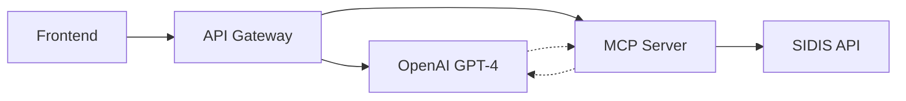

# SIDIS API Gateway - Documentación Técnica

**Versión:** 1.0.0  
**Fecha:** Octubre 2025  
**Autor:** Tyson Cardelli

## 📖 Índice

1. [Resumen Ejecutivo](#resumen-ejecutivo)
2. [Arquitectura del Sistema](#arquitectura-del-sistema)
3. [Componentes Implementados](#componentes-implementados)
4. [API Reference](#api-reference)
5. [Configuración](#configuración)
6. [Despliegue](#despliegue)
7. [Resolución de Problemas](#resolución-de-problemas)
8. [Roadmap](#roadmap)

---

## 🎯 Resumen Ejecutivo

### ¿Qué es SIDIS API Gateway?

SIDIS API Gateway es una **capa de abstracción inteligente** que permite a aplicaciones frontend interactuar con el CRM SIDIS usando **lenguaje natural**. 

### Valor de Negocio

- **Para Desarrolladores:** API REST simple para integrar IA conversacional
- **Para Clientes:** Consultas en lenguaje natural sobre sus datos CRM
- **Para el Negocio:** Producto comercializable como "CRM + IA"

### Tecnologías Clave



---

## 🏗️ Arquitectura del Sistema

### Flujo de Datos

1. **Cliente** envía consulta en lenguaje natural
2. **API Gateway** recibe y valida la petición
3. **LLM Service** determina qué herramientas usar
4. **MCP Service** ejecuta operaciones en SIDIS
5. **LLM Service** genera respuesta final
6. **Cliente** recibe datos estructurados

### Componentes Principales

```
┌─────────────────┐    ┌─────────────────┐    ┌─────────────────┐
│   Frontend      │    │  API Gateway    │    │   SIDIS API     │
│                 │    │                 │    │                 │
│ React/Vue/etc   │◄──►│ Express.js      │◄──►│ REST Endpoints  │
│                 │    │ + OpenAI        │    │                 │
└─────────────────┘    └─────────────────┘    └─────────────────┘
                              ▲
                              │
                    ┌─────────────────┐
                    │   MCP Server    │
                    │                 │
                    │ Tool Execution  │
                    └─────────────────┘
```

---

## 🔧 Componentes Implementados

### 1. Servicios Core

#### **McpService** (`src/services/mcp.service.ts`)
```typescript
class McpService {
    // Conexión con el servidor MCP original de SIDIS
    async initialize(): Promise<void>
    async callTool(toolName: string, args: any): Promise<any>
    async getAvailableTools(): Promise<McpTool[]>
    disconnect(): void
    isReady(): boolean
}
```

**Funciones:**
- ✅ Spawn del proceso MCP server
- ✅ Comunicación JSON-RPC 2.0
- ✅ Manejo de timeouts y errores
- ✅ Lista dinámica de herramientas

#### **LLMService** (`src/services/llm.service.ts`)
```typescript
class LLMService {
    // Integración con OpenAI (extensible a otros LLMs)
    async generateResponse(messages: ChatMessage[], tools?: any[]): Promise<ChatMessage>
    formatToolsForLLM(tools: any[]): any[]
}
```

**Funciones:**
- ✅ Integración OpenAI GPT-4
- ✅ Function calling automático
- ✅ Formateo de herramientas MCP para LLM
- 🔄 Preparado para Anthropic, Gemini

### 2. Controladores

#### **ChatController** (`src/controllers/chat.controller.ts`)
```typescript
class ChatController {
    async chat(req: Request, res: Response): Promise<void>
    async getTools(req: Request, res: Response): Promise<void>
    async clearConversation(req: Request, res: Response): Promise<void>
}
```

**Funciones:**
- ✅ Manejo de conversaciones multi-turn
- ✅ Ejecución automática de herramientas
- ✅ Historial de conversación
- ✅ System prompts especializados para SIDIS

### 3. Sistema de Tipos

#### **Tipos API** (`src/types/api.types.ts`)
```typescript
interface ChatRequest {
    message: string;
    model?: string;
    provider?: string;
    conversationId?: string;
    systemPrompt?: string;
}

interface ChatResponse {
    message: string;
    toolsUsed: number;
    model: string;
    conversationId: string;
}
```

#### **Tipos MCP** (`src/types/mcp.types.ts`)
```typescript
interface McpTool {
    name?: string;
    title: string;
    description: string;
    inputSchema: Record<string, any>;
}
```

### 4. Configuración y Utils

#### **CONFIG** (`src/utils/config.ts`)
```typescript
export const CONFIG = {
    PORT: number;
    SIDIS_API_BASE: string;
    SIDIS_API_KEY: string;
    LLM_PROVIDER: 'openai' | 'anthropic' | 'gemini';
    LLM_API_KEY: string;
    LLM_MODEL: string;
    // ... más configuraciones
}
```

#### **Logger** (`src/utils/logger.ts`)
```typescript
class Logger {
    static error(message: string, ...args: any[]): void
    static warn(message: string, ...args: any[]): void
    static info(message: string, ...args: any[]): void
    static debug(message: string, ...args: any[]): void
}
```

---

## 🔌 API Reference

### Base URL
```
http://localhost:3000/api
```

### Endpoints

#### **POST /chat**
Conversación inteligente con SIDIS

**Request:**
```json
{
    "message": "Lista los últimos 5 leads creados",
    "conversationId": "user-123",
    "model": "gpt-4o-mini"
}
```

**Response:**
```json
{
    "success": true,
    "data": {
        "message": "Aquí tienes los últimos 5 leads:\n1. Juan Pérez - Creado: 2025-10-13\n...",
        "toolsUsed": 2,
        "model": "gpt-4o-mini",
        "conversationId": "user-123"
    }
}
```

#### **GET /tools**
Lista de herramientas MCP disponibles

**Response:**
```json
{
    "success": true,
    "data": {
        "tools": [
            {
                "name": "leads_list",
                "title": "List Leads",
                "description": "Lista leads con filtros opcionales"
            }
        ],
        "count": 15
    }
}
```

#### **GET /health**
Estado del sistema

**Response:**
```json
{
    "success": true,
    "data": {
        "service": "SIDIS API Gateway",
        "status": "ok",
        "timestamp": "2025-10-13T10:00:00.000Z",
        "mcp": {
            "connected": true
        },
        "llm": {
            "provider": "openai",
            "model": "gpt-4o-mini"
        }
    }
}
```

#### **GET /status**
Métricas detalladas

**Response:**
```json
{
    "success": true,
    "data": {
        "mcp": {
            "connected": true,
            "toolsCount": 15
        },
        "llm": {
            "provider": "openai",
            "model": "gpt-4o-mini",
            "configured": true
        }
    }
}
```

---

## ⚙️ Configuración

### Variables de Entorno (`.env`)

```bash
# Servidor
PORT=3000
NODE_ENV=development

# SIDIS API
SIDIS_API_BASE=https://app4.sidis.ai/sidis/api
SIDIS_API_KEY=Bearer tu_token_real
SIDIS_MODELS_PATH=/models

# LLM
LLM_PROVIDER=openai
LLM_API_KEY=sk-tu_key_real
LLM_MODEL=gpt-4o-mini

# MCP
MCP_SERVER_PATH=../MCP/src/server.ts

# Opcional
JWT_SECRET=tu_jwt_secret
RATE_LIMIT_WINDOW_MS=900000
RATE_LIMIT_MAX_REQUESTS=100
```

### Configuración del MCP Server

El sistema espera que tu servidor MCP esté en la ruta especificada por `MCP_SERVER_PATH` y que tenga:

- Variables de entorno: `API_BASE`, `MODELS_PATH`, `BEARER_TOKEN`
- Salida esperada: `"MCP (stdio) listo"` cuando esté listo
- Protocolo: JSON-RPC 2.0 sobre stdio

---

## 🚀 Despliegue

### Desarrollo Local

```bash
# 1. Instalación
npm install
npm install -g tsx

# 2. Configuración
cp .env.example .env
# Editar .env con credenciales reales

# 3. Ejecución
npm run dev          # Con hot reload
npm run start:simple # Solo servidor básico
npm start           # Servidor completo
```

### Producción

```bash
# 1. Build
npm run build

# 2. Iniciar
npm run start:direct
# O usando PM2:
pm2 start dist/app.js --name "sidis-gateway"
```

### Docker

```dockerfile
FROM node:18-alpine

WORKDIR /app
COPY package*.json ./
RUN npm ci --only=production

COPY dist/ ./dist/
COPY .env ./

EXPOSE 3000
CMD ["node", "dist/app.js"]
```

### Variables de Entorno para Producción

```bash
# .env.production
NODE_ENV=production
PORT=3000

# URLs de producción
SIDIS_API_BASE=https://app.sidis.ai/api
LLM_PROVIDER=openai

# Credenciales (usar secrets del sistema)
SIDIS_API_KEY=${SIDIS_TOKEN}
LLM_API_KEY=${OPENAI_KEY}
JWT_SECRET=${JWT_SECRET}
```

---

## 🔍 Resolución de Problemas

### Problemas Comunes

#### 1. **MCP Server no conecta**

**Error:** `MCP server not connected`

**Solución:**
```bash
# Verificar que el path existe
ls ../MCP/src/server.ts

# Verificar que tsx está instalado
npm install -g tsx

# Verificar logs del MCP
# Buscar en los logs: "MCP (stdio) listo"
```

#### 2. **LLM no responde**

**Error:** `OpenAI API error: ...`

**Solución:**
```bash
# Verificar API key
echo $LLM_API_KEY

# Probar conexión
curl https://api.openai.com/v1/models \
  -H "Authorization: Bearer $LLM_API_KEY"
```

#### 3. **Herramientas no funcionan**

**Error:** `Error en herramienta ...`

**Solución:**
```bash
# Verificar conexión SIDIS
curl -H "Authorization: $SIDIS_API_KEY" \
     $SIDIS_API_BASE/models

# Verificar logs del MCP server
```

### Logs y Debugging

#### Habilitar Debug Logs
```bash
NODE_ENV=development npm start
# O
DEBUG=true npm run dev
```

#### Estructura de Logs
```
ℹ️ [INFO] 2025-10-13T10:00:00.000Z - 🚀 Inicializando SIDIS API Gateway...
🔌 [INFO] 2025-10-13T10:00:01.000Z - 📡 Conectando con MCP Server...
✅ [INFO] 2025-10-13T10:00:02.000Z - MCP Server conectado
🤖 [INFO] 2025-10-13T10:00:03.000Z - Configurando LLM (openai)...
💬 [INFO] 2025-10-13T10:00:04.000Z - Nueva consulta: Lista los últimos 5 leads
🛠️ [INFO] 2025-10-13T10:00:05.000Z - Herramientas disponibles: 15
🔧 [INFO] 2025-10-13T10:00:06.000Z - Ejecutando 2 herramientas...
📞 [INFO] 2025-10-13T10:00:07.000Z - Llamando: leads_list
✅ [INFO] 2025-10-13T10:00:08.000Z - Respuesta generada (2 herramientas usadas)
```

### Monitoreo

#### Health Checks
```bash
# Básico
curl http://localhost:3000/api/health

# Detallado
curl http://localhost:3000/api/status
```

#### Métricas en Producción
- Usar herramientas como PM2, New Relic o DataDog
- Monitorear endpoints `/api/health` y `/api/status`
- Alertas en fallos de MCP o LLM

---

## 🛣️ Roadmap

### Versión Actual (1.0.0)
- ✅ Integración OpenAI
- ✅ Conexión MCP
- ✅ Chat conversacional
- ✅ API REST completa

### Próximas Versiones

#### v1.1.0 - Más LLMs
- 🔄 Integración Anthropic Claude
- 🔄 Soporte Gemini
- 🔄 LLMs locales (Ollama)

#### v1.2.0 - Autenticación
- 🔄 JWT tokens
- 🔄 Rate limiting por usuario
- 🔄 Roles y permisos

#### v1.3.0 - Analytics
- 🔄 Métricas de uso
- 🔄 Dashboard admin
- 🔄 Logs estructurados

#### v2.0.0 - Multi-tenant
- 🔄 Múltiples clientes SIDIS
- 🔄 Configuración por tenant
- 🔄 Billing integrado

### Integraciones Futuras
- 🔄 Slack/Teams bots
- 🔄 WhatsApp Business
- 🔄 Webhooks
- 🔄 GraphQL API

---

## 📚 Recursos Adicionales

### Documentación Relacionada
- [SIDIS API Docs](https://docs.sidis.ai)
- [OpenAI API Reference](https://platform.openai.com/docs)
- [MCP Protocol Spec](https://modelcontextprotocol.io)

### Soporte
- **Email:** soporte@sidis.ai
- **Slack:** #api-gateway
- **Issues:** GitHub Issues

### Licencia
MIT License - Ver archivo LICENSE para detalles

---

**Última actualización:** Octubre 13, 2025
