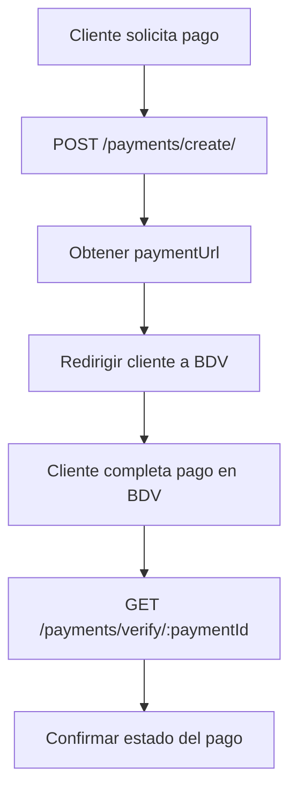
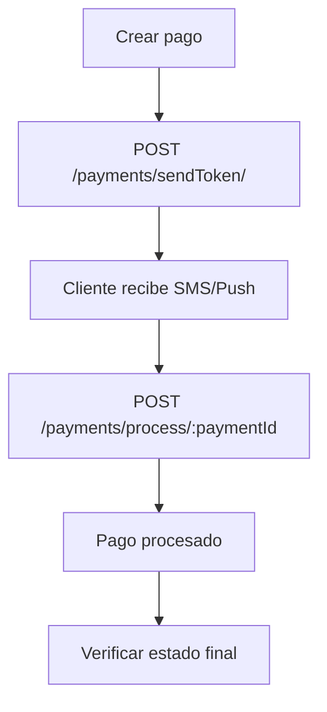

# Integración BDV - Botón de Pago

## Descripción General

Esta documentación describe la integración con la API de pagos BDV (Banco de Venezuela) implementada en el sistema SIDIS. La integración permite procesar pagos a través del botón de pago BDV utilizando su gateway de pagos BioPago2.

## Configuración de la API

### URL Base
- **Entorno Demo**: `https://biodemo.ex-cle.com:4443/Biopago2/IPG2/`

### Credenciales
- **Client ID**: `72917308`
- **Client Secret**: `Hvr6vF2h` ⚠️ *Configurar en variables de entorno*

## Endpoints Disponibles

### 1. Autenticación OAuth2

**Ruta**: `POST /payments/auth/`

Obtiene un token de acceso OAuth2 para autenticar las posteriores llamadas a la API BDV.

#### Request
```http
POST /payments/auth/
Content-Type: application/json
```

#### Response
```json
{
  "success": true,
  "token": {
    "access_token": "eyJhbGciOiJIUzI1NiIsInR5cCI6IkpXVCJ9...",
    "token_type": "Bearer",
    "expires_in": 3600
  }
}
```

#### Errores
```json
{
  "success": false,
  "error": "Descripción del error"
}
```

---

### 2. Crear Pago

**Ruta**: `POST /payments/create/`

Crea una nueva solicitud de pago en el sistema BDV.

#### Request
```http
POST /payments/create/
Content-Type: application/json

{
  "letter": "V",
  "number": "16085405",
  "amount": "1000000",
  "currency": "1",
  "reference": "FAC0001-00001552",
  "title": "Servicio de Cable",
  "description": "Abono mes de agosto 2025",
  "email": "tysoncardelli@gmail.com",
  "cellphone": "04122741219",
  "urlToReturn": "www.su-sitio.com/url-de-retorno"
}
```

#### Parámetros
- **letter**: Letra de la cédula (V, E, J, G)
- **number**: Número de cédula sin puntos ni guiones
- **amount**: Monto en céntimos (ej: 1000000 = 10.000,00 Bs)
- **currency**: Código de moneda (1 = Bolívares)
- **reference**: Referencia única del comercio
- **title**: Título descriptivo del pago
- **description**: Descripción detallada del servicio/producto
- **email**: Email del cliente
- **cellphone**: Teléfono celular del cliente
- **urlToReturn**: URL de retorno después del pago

#### Response Exitoso
```json
{
  "success": true,
  "data": {
    "paymentId": "17fd865f-2294-4299-8f8e-bbd7941a067b",
    "urlPayment": "https://biodemo.ex-cle.com:4443/Biopago2/IPG2/payments/17fd865f-2294-4299-8f8e-bbd7941a067b",
    "responseCode": 0,
    "responseDescription": "Operación realizada con éxito."
  }
}
```

#### Response Error
```json
{
  "success": false,
  "error": "Descripción del error de BDV"
}
```

---

### 3. Verificar Pago

**Ruta**: `GET /payments/verify/:paymentId`

Consulta el estado actual de un pago específico.

#### Request
```http
GET /payments/verify/17fd865f-2294-4299-8f8e-bbd7941a067b
```

#### Response
```json
{
  "success": true,
  "data": {
    "status": 1,
    "result": 1,
    "currency": 1,
    "amount": 1000000,
    "reference": "FAC0001-00001552",
    "title": "Servicio de Cable",
    "description": "Abono mes de agosto 2025",
    "letter": "V",
    "number": "16085405",
    "transactionId": 2100034994,
    "paymentMethodDescription": "Crédito Visa",
    "pan": "4050 XXXX XXXX 0003",
    "createdOn": "14/10/2025 05:26:33",
    "entityIPGId": 436,
    "urlToReturn": "www.su-sitio.com/url-de-retorno?id=17fd865f-2294-4299-8f8e-bbd7941a067b",
    "authorizationCode": "619627",
    "responseCode": 0,
    "responseDescription": "Operación realizada con éxito."
  }
}
```

#### Estados de Pago (campo `status`)
- **0**: Pago pendiente/en proceso
- **1**: Pago completado exitosamente
- **2**: Pago rechazado/fallido

#### Resultados de Transacción (campo `result`)
- **0**: Transacción rechazada
- **1**: Transacción aprobada

#### Códigos de Moneda (campo `currency`)
- **1**: Bolívares Venezolanos (VES)

---

### 4. Enviar Token de Autenticación

**Ruta**: `POST /payments/sendToken/`

Envía un token de autenticación al cliente para procesamiento adicional.

#### Request
```http
POST /payments/sendToken/
Content-Type: application/json

{
  "paymentId": "77a4bd89-2cd3-4fe0-813d-39ded245d54d",
  "paymentGroupId": 1,
  "authenticationMethodId": 4
}
```

#### Parámetros
- **paymentId**: ID único del pago generado en el paso de creación
- **paymentGroupId**: Grupo de método de pago (1 = Tarjetas)
- **authenticationMethodId**: Método de autenticación
  - **1**: Token por SMS
  - **4**: Otro método de autenticación

#### Response
```json
{
  "success": true,
  "data": {
    "responseCode": 0,
    "responseDescription": "Operación realizada con éxito."
  }
}
```

---

### 5. Procesar Pago

**Ruta**: `POST /payments/process/:paymentId`

Procesa un pago utilizando el token de autenticación recibido.

#### Request
```http
POST /payments/process/77a4bd89-2cd3-4fe0-813d-39ded245d54d
Content-Type: application/json

{
  "paymentMethodId": 3,
  "paymentGroupId": 1,
  "authenticationToken": "12294503",
  "authenticationMethodId": 1
}
```

#### Parámetros
- **paymentMethodId**: ID del método de pago específico
- **paymentGroupId**: Grupo de método de pago (1 = Tarjetas)
- **authenticationToken**: Token de autenticación recibido por SMS/otro método
- **authenticationMethodId**: Método usado para la autenticación (1 = SMS)

#### Response
```json
{
  "success": true,
  "data": {
    "responseCode": 15,
    "responseDescription": "Compra rechazada. 53 - Cuenta No Válida"
  }
}
```

#### Códigos de Respuesta Comunes
- **0**: Operación realizada con éxito
- **15**: Compra rechazada (ver descripción para detalles específicos)
- **53**: Cuenta No Válida
- Otros códigos según la respuesta del procesador de pagos

## Flujo de Pago Completo

### 1. Flujo Estándar



### 2. Flujo con Autenticación Token



## Flujo de Pago con Autenticación por Token

Para pagos que requieren autenticación adicional (como tarjetas de débito), se debe seguir este flujo:

### 1. Crear Pago → 2. Enviar Token → 3. Procesar con Token → 4. Verificar

```javascript
// Flujo completo con autenticación por token
const processPaymentWithToken = async (paymentData) => {
  try {
    // Paso 1: Crear el pago
    const createResponse = await fetch('/payments/create/', {
      method: 'POST',
      headers: { 'Content-Type': 'application/json' },
      body: JSON.stringify(paymentData)
    });
    
    const createResult = await createResponse.json();
    
    if (!createResult.success) {
      throw new Error('Error creando pago: ' + createResult.error);
    }
    
    const paymentId = createResult.data.paymentId;
    
    // Paso 2: Solicitar token por SMS
    const tokenResponse = await fetch('/payments/sendToken/', {
      method: 'POST',
      headers: { 'Content-Type': 'application/json' },
      body: JSON.stringify({
        paymentId: paymentId,
        paymentGroupId: 1, // Tarjetas
        authenticationMethodId: 1 // SMS
      })
    });
    
    const tokenResult = await tokenResponse.json();
    
    if (!tokenResult.success) {
      throw new Error('Error enviando token: ' + tokenResult.error);
    }
    
    // Mostrar campo para que el usuario ingrese el token
    const userToken = await showTokenInputDialog();
    
    // Paso 3: Procesar pago con el token
    const processResponse = await fetch(`/payments/process/${paymentId}`, {
      method: 'POST',
      headers: { 'Content-Type': 'application/json' },
      body: JSON.stringify({
        paymentMethodId: 3, // ID del método específico
        paymentGroupId: 1,
        authenticationToken: userToken,
        authenticationMethodId: 1
      })
    });
    
    const processResult = await processResponse.json();
    
    // Paso 4: Verificar resultado final
    if (processResult.success && processResult.data.responseCode === 0) {
      showSuccessMessage('¡Pago procesado exitosamente!');
    } else {
      showErrorMessage('Pago rechazado: ' + processResult.data.responseDescription);
    }
    
  } catch (error) {
    showErrorMessage('Error en el proceso: ' + error.message);
  }
};

// Función auxiliar para mostrar diálogo de token
const showTokenInputDialog = () => {
  return new Promise((resolve) => {
    const token = prompt('Ingrese el código recibido por SMS:');
    resolve(token);
  });
};
```

## Ejemplos de Uso

### Ejemplo JavaScript (Frontend)

```javascript
// 1. Crear pago
const createPayment = async (paymentData) => {
  try {
    const response = await fetch('/payments/create/', {
      method: 'POST',
      headers: {
        'Content-Type': 'application/json',
        'Authorization': 'Bearer ' + userToken
      },
      body: JSON.stringify(paymentData)
    });
    
    const result = await response.json();
    
    if (result.success) {
      // Redirigir al usuario a la URL de pago BDV
      window.location.href = result.data.urlPayment;
      
      // Guardar paymentId para verificación posterior
      localStorage.setItem('bdv_payment_id', result.data.paymentId);
    } else {
      console.error('Error creando pago:', result.error);
    }
  } catch (error) {
    console.error('Error:', error);
  }
};

// 2. Verificar pago (después del retorno)
const verifyPayment = async (paymentId) => {
  try {
    const response = await fetch(`/payments/verify/${paymentId}`);
    const result = await response.json();
    
    if (result.success) {
      const status = result.data.status;
      const resultCode = result.data.result;
      
      if (status === 1 && resultCode === 1) {
        showSuccessMessage('¡Pago completado exitosamente!');
        showPaymentDetails({
          transactionId: result.data.transactionId,
          authorizationCode: result.data.authorizationCode,
          paymentMethod: result.data.paymentMethodDescription,
          amount: result.data.amount / 100 // Convertir de céntimos
        });
      } else if (status === 0) {
        showWarningMessage('Pago en proceso...');
      } else {
        showErrorMessage('Pago rechazado: ' + result.data.responseDescription);
      }
    }
  } catch (error) {
    console.error('Error verificando pago:', error);
  }
};
```

### Ejemplo Node.js (Backend)

```javascript
// Crear un pago desde el backend
const createBDVPayment = async (orderData) => {
  const paymentRequest = {
    letter: orderData.customer.documentType, // V, E, J, G
    number: orderData.customer.documentNumber,
    amount: (orderData.total * 100).toString(), // Convertir a céntimos
    currency: "1", // Bolívares
    reference: `ORD-${orderData.orderNumber}`,
    title: `Pedido #${orderData.orderNumber}`,
    description: orderData.description || `Compra en ${process.env.APP_NAME}`,
    email: orderData.customer.email,
    cellphone: orderData.customer.phone,
    urlToReturn: `${process.env.APP_URL}/payment/return`
  };
  
  try {
    const response = await axios.post('/payments/create/', paymentRequest);
    return response.data;
  } catch (error) {
    throw new Error(`Error creando pago BDV: ${error.message}`);
  }
};
```

## Manejo de Errores

### Códigos de Respuesta BDV

| Código | Descripción | Acción Recomendada |
|--------|-------------|-------------------|
| 0 | Operación realizada con éxito | Continuar con el flujo |
| 15 | Compra rechazada | Ver responseDescription para detalles |
| 53 | Cuenta No Válida | Verificar datos de la tarjeta |
| 400 | Datos de solicitud inválidos | Verificar formato de parámetros |
| 401 | Token OAuth2 inválido | Renovar token de autenticación |
| 404 | Pago no encontrado | Verificar paymentId |
| 500 | Error interno del servidor BDV | Reintentar después |

### Estados de Transacción

| Status | Result | Significado |
|--------|--------|-------------|
| 0 | - | Pago pendiente/en proceso |
| 1 | 1 | Pago completado y aprobado ✅ |
| 1 | 0 | Pago completado pero rechazado ❌ |
| 2 | - | Pago fallido/rechazado ❌ |

### Implementación de Reintentos

```javascript
const retryPaymentOperation = async (operation, maxRetries = 3) => {
  for (let attempt = 1; attempt <= maxRetries; attempt++) {
    try {
      return await operation();
    } catch (error) {
      if (attempt === maxRetries) {
        throw error;
      }
      
      // Esperar antes del siguiente intento
      await new Promise(resolve => 
        setTimeout(resolve, attempt * 1000)
      );
    }
  }
};
```

## Consideraciones Importantes

### 1. Formato de Montos
⚠️ **IMPORTANTE**: Los montos deben enviarse en **céntimos** como string.

```javascript
// ❌ Incorrecto
amount: 100.50

// ✅ Correcto  
amount: "10050" // Representa 100,50 Bs

// Función helper para convertir
const formatAmount = (amount) => {
  return (amount * 100).toString();
};

// Ejemplo: 1.234,56 Bs → "123456"
const amountInCents = formatAmount(1234.56); // "123456"
```

### 2. Códigos de Documento
- **V**: Venezolano
- **E**: Extranjero  
- **J**: Jurídico
- **G**: Gubernamental

### 3. URL de Retorno
La URL de retorno recibirá el `paymentId` como parámetro:
```
www.su-sitio.com/url-de-retorno?id=17fd865f-2294-4299-8f8e-bbd7941a067b
```

## Seguridad y Best Practices

### 1. Seguridad
- ✅ **HTTPS obligatorio** para todas las comunicaciones
- ✅ **Validar tokens OAuth2** en cada llamada
- ✅ **No exponer credenciales** en el frontend
- ✅ **Validar firmas** de webhooks (si están disponibles)

### 2. Configuración de Entorno

```bash
# Variables de entorno recomendadas
BDV_CLIENT_ID=72917308
BDV_CLIENT_SECRET=Hvr6vF2h
BDV_ENVIRONMENT=demo # demo | production
BDV_BASE_URL=https://biodemo.ex-cle.com:4443/Biopago2/IPG2/
```

### 3. Logging y Monitoreo

```javascript
// Implementar logging para auditoría
const logPaymentOperation = (operation, paymentId, result) => {
  console.log({
    timestamp: new Date().toISOString(),
    operation,
    paymentId,
    success: result.success,
    userId: req.user?.id,
    ip: req.ip
  });
};
```

## Testing

### Datos de Prueba (Entorno Demo)

```javascript
// Datos de prueba para testing
const testPaymentData = {
  letter: "V",
  number: "16085405",
  amount: "1000000", // 10.000,00 Bs (en céntimos)
  currency: "1", // Bolívares
  reference: "TEST-" + Date.now(),
  title: "Pago de Prueba",
  description: "Transacción de prueba del sistema",
  email: "test@example.com",
  cellphone: "04122741219",
  urlToReturn: "https://tu-app.com/return"
};
```

## Webhooks (Futuro)

Cuando BDV implemente webhooks, será necesario agregar:

```javascript
// Endpoint para recibir notificaciones
router.post('/webhook/bdv', (req, res) => {
  // Validar firma del webhook
  // Procesar notificación de estado
  // Actualizar estado interno del pago
});
```

## Contacto y Soporte

Para problemas con la integración BDV:
- **Documentación oficial**: Consultar con BDV
- **Soporte técnico**: Equipo de desarrollo SIDIS
- **Ambiente de pruebas**: `https://biodemo.ex-cle.com:4443/`

---

*Última actualización: 16 de Octubre, 2025*